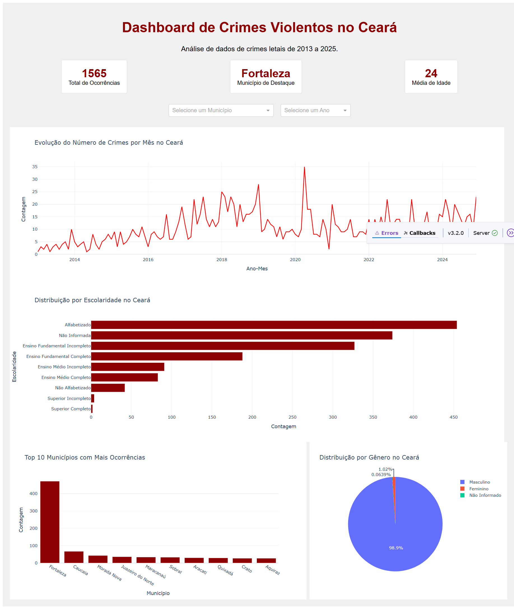

# 📊 Dashboard de Crimes no Ceará

Este projeto apresenta um dashboard interativo para a visualização de dados sobre crimes registrados no estado do Ceará. O objetivo é fornecer uma ferramenta para análise e consulta das estatísticas de segurança pública de forma clara e acessível. Para esse projeto eu fiz o uso do Gemini para desenvolver a plataforma e me ensinar sobre a codificaação.

## 🚀 Funcionalidades

-   🗺️ Visualização de dados em mapas interativos.
-   🔍 Filtros por tipo de crime, cidade e período (ano/mês).
-   📈 Gráficos e tabelas para análise de tendências.
-   📱 Interface amigável e responsiva.

## 🛠️ Tecnologias Utilizadas

-   **Linguagem:** Python 🐍
-   **Bibliotecas de Dados:** Pandas 🐼
-   **Dashboard:** Streamlit 🎈
-   **Visualização:** Plotly Express 📊

## 📊 Fonte dos Dados

Os dados utilizados neste projeto são provenientes da [Secretaria da Segurança Pública e Defesa Social do Ceará (SSPDS/CE)](https://www.sspds.ce.gov.br/estatisticas/).

## ⚙️ Como Executar o Projeto

Siga os passos abaixo para executar o dashboard localmente.

### ✅ Pré-requisitos

-   Python 3.8+
-   Pip

### 📦 Instalação

1.  Clone o repositório:
    ```bash
    git clone https://github.com/seu-usuario/dashboard_crimes_ce.git
    cd dashboard_crimes_ce
    ```

2.  Crie um ambiente virtual (recomendado):
    ```bash
    python -m venv venv
    # No Windows:
    # venv\Scripts\activate
    # No Linux/macOS:
    # source venv/bin/activate
    ```

3.  Instale as dependências:
    ```bash
    pip install -r requirements.txt
    ```

### ▶️ Execução

1.  Para iniciar o dashboard, execute o comando no terminal:
    ```bash
    streamlit run app.py
    ```

2.  Abra o seu navegador e acesse o endereço `http://localhost:8501`.

## 🖼️ Demonstração



## 📄 Licença

Este projeto está sob a licença MIT. Veja o arquivo [LICENSE](LICENSE) para mais detalhes.


## 👨‍💻 Desenvolvido por

**Rafael Pereira**

-   [LinkedIn](https://www.linkedin.com/in/rafael-pereira-9306a4107)
-   [GitHub](https://github.com/rafaelp89)